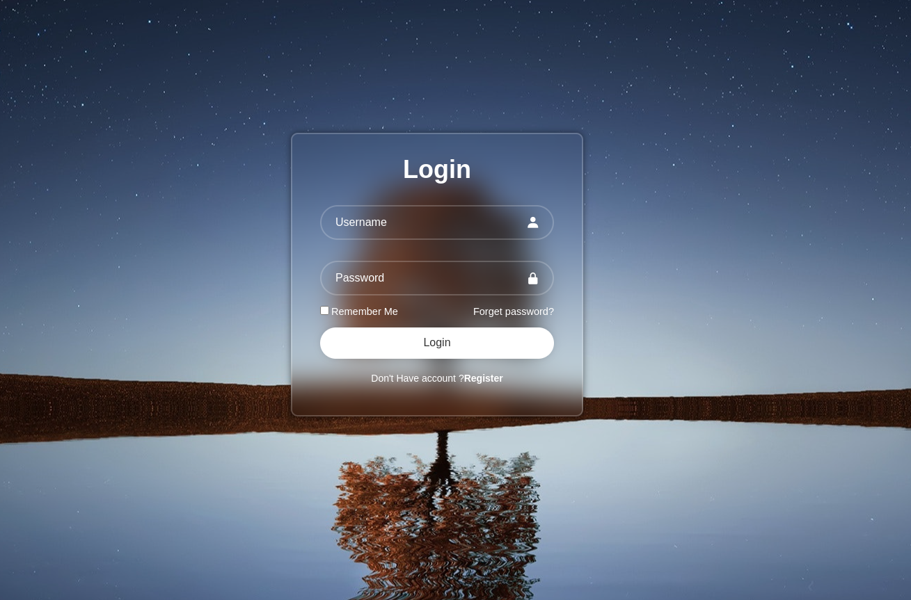

# Beginner-Friendly Front-End Development Repositories

Welcome to our curated collection of beginner-friendly front-end development repositories! Whether you're just starting your journey in web development or looking to hone your skills, you'll find a variety of projects here to help you learn and grow.

## Table of Contents
- [Getting Started](#getting-started)
- [Projects](#projects)
- [Contributing](#contributing)
- [License](#license)

## Getting Started

Before diving into the projects, make sure you have the following prerequisites:
- A text editor or Integrated Development Environment (IDE) of your choice (e.g., Visual Studio Code, Sublime Text)
- Basic understanding of HTML, CSS, and JavaScript

### How to Use This Repository

1. Clone or fork this repository to your local machine.
2. Browse the list of projects below and choose one that interests you.
3. Click on the project's link to access its repository.
4. Follow the project's README and documentation to get started with that specific project.
5. Feel free to explore and contribute to any project you like.

## Projects

Here are some beginner-friendly front-end development projects to help you practice and improve your skills:

### 1. Simple To-Do List

- Description: Create a basic House Web page using HTML, CSS.
- Skills: HTML, CSS
- Repository Link: [House](https://github.com/3bduu/Front_for_Beginner/tree/main/House)

### 2. Responsive Personal Portfolio

- Description: Build a Login web page.
- Skills: HTML, CSS
- Repository Link: [Login](https://github.com/3bduu/Front_for_Beginner/tree/main/login_page)

Feel free to explore these projects and contribute to them as you learn. If you have ideas for additional beginner-friendly projects, please consider contributing them to this repository.

## Contributing

We welcome contributions from the community! If you have a project idea, found a bug, or want to improve existing projects, please follow these steps:

1. Fork this repository to your GitHub account.
2. Create a new branch with a descriptive name for your contribution.
3. Make your changes and commit them with clear messages.
4. Create a pull request (PR) with details about your contribution.

We'll review your PR and provide feedback as needed. Together, we can make this repository a valuable resource for beginner front-end developers.

## License

This repository and the projects within it are open-source and available under the [MIT License](LICENSE). Feel free to use, modify, and distribute them for educational and personal purposes.
